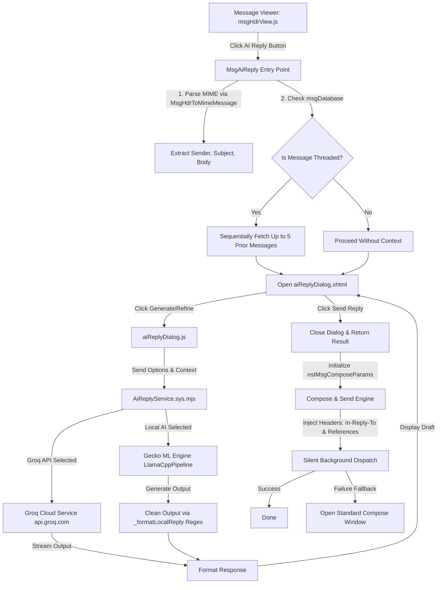

# Thunderbird AI Reply - Architecture & Integration Guide

This document provides a comprehensive overview of the AI Reply feature implemented within Thunderbird and Gecko. It is designed to serve as a complete guide to understanding the feature's architecture, data flows, and component structure. Additionally, it contains the full code content of new files and the exact diffs of modified files so that the feature can be easily rebuilt and integrated into fresh checkouts of the Firefox and Thunderbird codebases in the future.

---

## 1. Feature Architecture & Design

The AI Reply feature integrates directly into Thunderbird's message viewing pane, introducing a modern, high-fidelity dialog that allows users to generate and refine replies using either a cloud-based Large Language Model (LLM) or a local, offline Small Language Model (SLM).

### Architectural Diagram



### Key Components

1. **Toolbar Entry Point (msgHdrView.inc.xhtml & msgHdrView.js)**
   Adds a styled "AI Reply" button to the header pane. When clicked, it parses the selected email, walks the folder database to extract historical thread context (up to 5 prior emails) sequentially to avoid parallel database collisions, and displays the dialog.

2. **Frontend UI Dialog (aiReplyDialog.xhtml & aiReplyDialog.js)**
   A modern, glassmorphism-themed dialog with drop-downs for Voice/Tone, Length, Language, Salutations, and Signatures. Includes a developer/error log console to help debug API or offline ML engine errors in real-time. Features input debouncing for dropdown selection changes to prevent immediate redundant requests.

3. **Backend Service Broker (AiReplyService.sys.mjs)**
   Brokers connections between Thunderbird and either the cloud-based Groq API or the local offline SmolLM2-360M engine running via Gecko's built-in ML runner. Implements prompt engineering templates and translation logic to make local generation robust.

4. **Offline ML Pipeline Correction (LlamaCppPipeline.mjs)**
   Modifies Gecko's built-in local token streaming handler to compile and return individual output token chunks using `chunk.piece` instead of whole chunk objects.

5. **Silent Compose & Dispatch Engine (msgHdrView.js)**
   Initializes a background compose instance, stamps it with threading headers (`References` and `In-Reply-To`), and sends it silently. Falls back to opening a visible compose window with the generated content if the background send fails.

---

## 2. File Location Map

To reconstruct this feature in a new workspace, the files must be placed in the following locations within the repositories:

| File Name | Repository | Path | Type | Description |
| :--- | :--- | :--- | :--- | :--- |
| **launch_gui.sh** | Firefox/Gecko | `launch_gui.sh` | New Script | Shell script to spin up Xvfb, VNC, and run Thunderbird. |
| **LlamaCppPipeline.mjs** | Firefox/Gecko | `toolkit/components/ml/content/backends/LlamaCppPipeline.mjs` | Modified | Core token streaming bugfix for local inference. |
| **msgHdrView.inc.xhtml** | Thunderbird/Comm | `comm/mail/base/content/msgHdrView.inc.xhtml` | Modified | Adds the "AI Reply" toolbar button. |
| **msgHdrView.js** | Thunderbird/Comm | `comm/mail/base/content/msgHdrView.js` | Modified | Thread extraction, dialog loading, and silent send logic. |
| **jar.mn** | Thunderbird/Comm | `comm/mail/base/jar.mn` | Modified | Registers new dialog files into Thunderbird's chrome provider. |
| **moz.build** | Thunderbird/Comm | `comm/mail/modules/moz.build` | Modified | Registers the backend AI ES Module. |
| **AiReplyService.sys.mjs** | Thunderbird/Comm | `comm/mail/modules/AiReplyService.sys.mjs` | New File | Backend LLM/SLM service broker. |
| **aiReplyDialog.xhtml** | Thunderbird/Comm | `comm/mail/base/content/aiReplyDialog.xhtml` | New File | Dialog window markup and styling (CSS variables). |
| **aiReplyDialog.js** | Thunderbird/Comm | `comm/mail/base/content/aiReplyDialog.js` | New File | Dialog UI logic, debouncing, and preferences controller. |
| **test.xhtml** | Thunderbird/Comm | `comm/mail/base/content/test.xhtml` | New File | Standard test page boilerplate. |

---

## 3. Integration & Build Guide

When restoring these files onto clean checkouts of Firefox and Thunderbird:

1. **Place the files** in the exact paths indicated in the File Location Map.
2. **Re-build Thunderbird** using the mach build command:
   ```bash
   ./mach build
   ```
   *Note: If you only modified JS or XHTML front-end files (such as `aiReplyDialog.js` or `msgHdrView.js`), you do not need to recompile C++/Rust binaries. You can compile faster by running:*
   ```bash
   ./mach build faster
   ```
3. **Run Thunderbird** with the specific ML flags enabled to allow the local SmolLM2 engine to function offline:
   ```bash
   export MOZ_DISABLE_CONTENT_SANDBOX=1
   export MOZ_ALLOW_EXTERNAL_ML_HUB=1
   ./mach run
   ```

---

## 4. Modified Files Reference (Diffs)

### A. Firefox/Gecko - LlamaCppPipeline.mjs
Path: `toolkit/components/ml/content/backends/LlamaCppPipeline.mjs`
```diff
diff --git a/toolkit/components/ml/content/backends/LlamaCppPipeline.mjs b/toolkit/components/ml/content/backends/LlamaCppPipeline.mjs
index 845d28fbd16e..392ccce97447 100644
--- a/toolkit/components/ml/content/backends/LlamaCppPipeline.mjs
+++ b/toolkit/components/ml/content/backends/LlamaCppPipeline.mjs
@@ -278,7 +278,7 @@ export class LlamaCppPipeline {
         if (skipPrompt && isPrompt) {
           continue;
         }
-        output += chunk;
+        output += chunk.piece;
         port?.postMessage({
           tokens: chunk.tokens,
           ok: true,
```

### B. Thunderbird/Comm - msgHdrView.inc.xhtml
Path: `comm/mail/base/content/msgHdrView.inc.xhtml`
```diff
diff -r 2d266d64d3c5 mail/base/content/msgHdrView.inc.xhtml
--- a/mail/base/content/msgHdrView.inc.xhtml    Sat Mar 28 11:41:26 2026 +0200
+++ b/mail/base/content/msgHdrView.inc.xhtml    Fri Jul 03 05:42:24 2026 +0000
@@ -122,6 +122,12 @@
                      tooltiptext="&hdrForwardButton1.tooltip;"
                      oncommand="MsgForwardMessage(event);"
                      class="toolbarbutton-1 message-header-view-button hdrForwardButton"/>
+      <toolbarbutton id="hdrAiReplyButton"
+                     label="AI Reply"
+                     tooltiptext="Generate an AI-powered reply"
+                     oncommand="MsgAiReply();"
+                     style="list-style-image: url('data:image/svg+xml;base64,PHN2ZyB4bWxucz0iaHR0cDovL3d3dy53My5vcmcvMjAwMC9zdmciIHdpZHRoPSIxNiIgaGVpZ2h0PSIxNiIgdmlld0JveD0iMCAwIDI0IDI0IiBmaWxsPSJub25lIiBzdHJva2U9IiM3YzRkZmYiIHN0cm9rZS13aWR0aD0iMi41IiBzdHJva2UtbGluZWNhcD0icm91bmQiIHN0cm9rZS1saW5lam9pbj0icm91bmQiPjxwYXRoIGQ9Im0xMiAzLTEuOTEyIDUuODEzYTIgMiAwIDAgMS0xLjI3NSAxLjI3NUwzIDEybDUuODEzIDEuOTEyYTIgMiAwIDAgMSAxLjI3NSAxLjI3NUwxMiAyMWwxLjkxMi01LjgxM2EyIDIgMCAwIDEgMS4yNzUtMS4yNzVMMjEgMTJsLTUuODEzLTEuOTEyYTIgMiAwIDAgMS0xLjI3NS0xLjI3NUwxMiAzWiIvPjwvc3ZnPg==');"
+                     class="toolbarbutton-1 message-header-view-button hdrAiReplyButton"/>
       <toolbarbutton id="hdrArchiveButton"
                      label="&hdrArchiveButton1.label;"
                      tooltiptext="&hdrArchiveButton1.tooltip;"
```

### C. Thunderbird/Comm - msgHdrView.js
Path: `comm/mail/base/content/msgHdrView.js`
```diff
diff -r 2d266d64d3c5 mail/base/content/msgHdrView.js
--- a/mail/base/content/msgHdrView.js   Sat Mar 28 11:41:26 2026 +0200
+++ b/mail/base/content/msgHdrView.js   Fri Jul 03 05:42:28 2026 +0000
@@ -3562,6 +3562,7 @@
     "hdrFollowupButton",
     "hdrForwardButton",
     "hdrReplyToSenderButton",
+    "hdrAiReplyButton",
   ]) {
     document.getElementById(id).disabled = !hasIdentities;
   }
@@ -3632,6 +3633,166 @@
   commandController._composeMsgByType(Ci.nsIMsgCompType.Draft, event);
 }
 
+/**
+ * Open the AI Reply dialog for the currently displayed message, then open
+ * the compose window pre-filled with the AI-generated reply text.
+ */
+function MsgAiReply() {
+  if (!gMessage) {
+    return;
+  }
+
+  const { MsgHdrToMimeMessage } = ChromeUtils.importESModule(
+    "resource:///modules/gloda/MimeMessage.sys.mjs"
+  );
+  const { MailUtils } = ChromeUtils.importESModule(
+    "resource:///modules/MailUtils.sys.mjs"
+  );
+
+  MsgHdrToMimeMessage(
+    gMessage,
+    null,
+    async function (msgHdr, mimeMsg) {
+      try {
+        const msgFolder = gMessage.folder;
+        const body = mimeMsg?.body || (msgFolder ? mimeMsg?.coerceBodyToPlaintext(msgFolder) : "") || "";
+        const subject = msgHdr.mime2DecodedSubject || "";
+        const sender = msgHdr.mime2DecodedAuthor || msgHdr.author || "";
+
+        let contextMessages = [];
+        try {
+          console.log("AI Reply: Fetching thread context...");
+          if (msgFolder) {
+            let msgDB = msgFolder.msgDatabase;
+            let thread = msgDB ? msgDB.getThreadContainingMsgHdr(gMessage) : null;
+            if (thread && thread.numChildren > 1) {
+              let threadHdrs = [];
+              for (let i = 0; i < thread.numChildren; i++) {
+                threadHdrs.push(thread.getChildHdrAt(i));
+              }
+              let currentIndex = threadHdrs.findIndex(hdr => hdr.messageId === gMessage.messageId);
+              console.log(`AI Reply: Thread detected. Children: ${thread.numChildren}, CurrentIdx: ${currentIndex}`);
+              if (currentIndex > 0) {
+                // Fetch up to 5 preceding messages for context
+                let startIdx = Math.max(0, currentIndex - 5);
+                let priorHdrs = threadHdrs.slice(startIdx, currentIndex);
+                // Fetch sequentially to avoid colliding MsgHdrToMimeMessage's internal tunnels
+                for (let hdr of priorHdrs) {
+                  await new Promise(resolve => {
+                    MsgHdrToMimeMessage(
+                      hdr, 
+                      null, 
+                      (childHdr, childMimeMsg) => {
+                        let cBody = childMimeMsg?.body || (childHdr.folder ? childMimeMsg?.coerceBodyToPlaintext(childHdr.folder) : "") || "";
+                        let cSender = childHdr.mime2DecodedAuthor || childHdr.author || "Unknown";
+                        let cDate = new Date(childHdr.date / 1000).toLocaleString();
+                        contextMessages.push({ sender: cSender, date: cDate, body: cBody });
+                        resolve();
+                      },
+                      true,
+                      { saneBodySize: true }
+                    );
+                  });
+                }
+                console.log(`AI Reply: Successfully fetched ${contextMessages.length} context messages.`);
+              } else {
+                console.log("AI Reply: Current message is the root of the thread, no previous context.");
+              }
+            } else {
+              console.log("AI Reply: No thread found or singleton thread.");
+            }
+          }
+        } catch (ctxErr) {
+          console.error("AI Reply: Failed to fetch thread context. Non-fatal, continuing.", ctxErr);
+        }
+
+        console.log("AI Reply: Opening dialog...");
+        const emailData = { body, subject, sender, contextMessages };
+        const result = {};
+
+        window.openDialog(
+          "chrome://messenger/content/aiReplyDialog.xhtml",
+          "aiReply",
+          "chrome,dialog,modal,resizable,width=640,height=650",
+          emailData,
+          result
+        );
+
+        console.log("AI Reply: Dialog closed. Result:", result.result ? "Text received" : "Canceled");
+        if (!result.result) {
+          return;
+        }
+
+        const replyText = result.result;
+        const msgUri = msgFolder
+          ? msgFolder.getUriForMsg(gMessage)
+          : window.gMessageURI;
+
+        console.log("AI Reply: Fetching identity for header...");
+        const [identity] = MailUtils.getIdentityForHeader(
+          msgHdr,
+          Ci.nsIMsgCompType.ReplyToSender
+        );
+        console.log("AI Reply: Identity found:", identity ? identity.identityName : "None");
+
+        const params = Cc[
+          "@mozilla.org/messengercompose/composeparams;1"
+        ].createInstance(Ci.nsIMsgComposeParams);
+        params.type = Ci.nsIMsgCompType.ReplyToSender;
+        params.format = Ci.nsIMsgCompFormat.HTML;
+        params.identity = identity;
+        params.originalMsgURI = msgUri;
+        params.htmlToQuote = " "; 
+
+        const fields = Cc[
+          "@mozilla.org/messengercompose/composefields;1"
+        ].createInstance(Ci.nsIMsgCompFields);
+        fields.to = sender;
+        fields.subject = subject.startsWith("Re: ") ? subject : "Re: " + subject;
+        const escapedReplyText = replyText
+          .replace(/&/g, "&amp;")
+          .replace(/</g, "&lt;")
+          .replace(/>/g, "&gt;")
+          .replace(/\r?\n/g, "<br>");
+        fields.body = `<div>${escapedReplyText}</div>`;
+
+        let msgIdStr = "<" + msgHdr.messageId + ">";
+        let existingRefs = msgHdr.getStringProperty("references");
+        fields.references = existingRefs ? existingRefs + " " + msgIdStr : msgIdStr;
+        fields.setHeader("In-Reply-To", msgIdStr);
+        fields.setHeader("References", fields.references);
+
+        params.composeFields = fields;
+
+        console.log("AI Reply: Initializing silent compose object with forced recipients...");
+        try {
+          const msgCompose = MailServices.compose.initCompose(params, window, null);
+          console.log("AI Reply: Dispatching background send...");
+          
+          msgCompose.sendMsg(Ci.nsIMsgCompDeliverMode.Now, identity, "", null).then(() => {
+            console.log("AI Reply: Message sent successfully in background.");
+          }).catch(err => {
+            console.error("AI Reply: Background send promise rejected:", err);
+            params.htmlToQuote = ""; 
+            MailServices.compose.OpenComposeWindowWithParams(null, params);
+          });
+        } catch (ex) {
+          console.error("AI Reply: Error initializing silent compose:", ex);
+          MailServices.compose.OpenComposeWindowWithParams(null, params);
+        }
+      } catch (err) {
+        console.error("AI Reply: Unexpected error in MsgAiReply callback:", err);
+      }
+    },
+    true,
+    { saneBodySize: true }
+  );
+}
```

### D. Thunderbird/Comm - jar.mn
Path: `comm/mail/base/jar.mn`
```diff
diff -r 2d266d64d3c5 mail/base/jar.mn
--- a/mail/base/jar.mn  Sat Mar 28 11:41:26 2026 +0200
+++ b/mail/base/jar.mn  Fri Jul 03 05:42:16 2026 +0000
@@ -63,6 +63,9 @@
     content/messenger/migrationProgress.js          (content/migrationProgress.js)
     content/messenger/migrationProgress.xhtml       (content/migrationProgress.xhtml)
     content/messenger/msgHdrView.js                 (content/msgHdrView.js)
+    content/messenger/aiReplyDialog.js              (content/aiReplyDialog.js)
+    content/messenger/aiReplyDialog.xhtml           (content/aiReplyDialog.xhtml)
+    content/messenger/test.xhtml                    (content/test.xhtml)
     content/messenger/msgSecurityPane.js            (content/msgSecurityPane.js)
     content/messenger/msgViewNavigation.js          (content/msgViewNavigation.js)
     content/messenger/multimessageview.js           (content/multimessageview.js)
```

### E. Thunderbird/Comm - moz.build
Path: `comm/mail/modules/moz.build`
```diff
diff -r 2d266d64d3c5 mail/modules/moz.build
--- a/mail/modules/moz.build    Sat Mar 28 11:41:26 2026 +0200
+++ b/mail/modules/moz.build    Fri Jul 03 05:42:16 2026 +0000
@@ -9,6 +9,7 @@
 ]
 
 EXTRA_JS_MODULES += [
+    "AiReplyService.sys.mjs",
     "AttachmentChecker.worker.js",
     "AttachmentInfo.sys.mjs",
     "BrowserWindowTracker.sys.mjs",
```

---

## 5. Complete Source Code of New Files

### A. launch_gui.sh
Path: `launch_gui.sh`
```bash
#!/bin/bash
# Stop any existing GUI processes
pkill -f Xvfb
pkill -f fluxbox
pkill -f x11vnc
pkill -f websockify
pkill -f thunderbird
sleep 2

# 1. Start virtual display
echo "Starting Xvfb..."
Xvfb :99 -screen 0 1280x900x24 &
sleep 2

# 2. Start Window Manager (so windows can be moved/resized)
echo "Starting Fluxbox..."
DISPLAY=:99 fluxbox &
sleep 1

# 3. Start VNC Server (no password needed since this is a temporary private test)
echo "Starting x11vnc..."
x11vnc -display :99 -nopw -bg -xkb -forever -quiet

# 4. Start noVNC Web Proxy
echo "Starting noVNC (websockify)..."
websockify --web /usr/share/novnc 6080 localhost:5900 &
sleep 2

# 5. Start Thunderbird
echo "Starting Thunderbird..."
export DISPLAY=:99
export MOZ_DISABLE_CONTENT_SANDBOX=1
export MOZ_ALLOW_EXTERNAL_ML_HUB=1
/home/azureuser/firefox/obj-x86_64-pc-linux-gnu/dist/bin/thunderbird --no-remote > /home/azureuser/firefox/tb_error.log 2>&1 &

echo "============================================================"
echo "GUI Environment Started Successfully!"
echo "To view Thunderbird, open your web browser and go to:"
echo "http://<your-azure-vm-ip>:6080/vnc.html"
echo "============================================================"
```

### B. AiReplyService.sys.mjs
Path: `comm/mail/modules/AiReplyService.sys.mjs`
```javascript
/* This Source Code Form is subject to the terms of the Mozilla Public
 * License, v. 2.0. If a copy of the MPL was not distributed with this
 * file, you can obtain one at http://mozilla.org/MPL/2.0/. */

const { createEngine } = ChromeUtils.importESModule(
  "chrome://global/content/ml/EngineProcess.sys.mjs"
);

const GROQ_API_URL = "https://api.groq.com/openai/v1/chat/completions";
const GROQ_MODEL = "llama-3.3-70b-versatile";

// Default API key. Replace with your own from https://console.groq.com
const DEFAULT_API_KEY = "gsk_YOUR_GROQ_API_KEY_PLACEHOLDER";

function getApiKey() {
  try {
    return Services.prefs.getStringPref(
      "mail.ai_reply.api_key",
      DEFAULT_API_KEY
    );
  } catch {
    return DEFAULT_API_KEY;
  }
}

let gLocalEngine = null;

async function getLocalEngine(progressCallback = null) {
  if (gLocalEngine && gLocalEngine.engineStatus === "ready") {
    return gLocalEngine;
  }
  try {
    Services.prefs.setBoolPref("browser.ml.enable", true);
  } catch (e) {
    console.error("AI Reply: Failed to enable browser.ml.enable", e);
  }
  gLocalEngine = await createEngine({
    taskName: "text-generation",
    modelHub: "huggingface",
    modelId: "HuggingFaceTB/SmolLM2-360M-Instruct-GGUF",
    modelFile: "smollm2-360m-instruct-q8_0.gguf",
    modelRevision: "main",
    kvCacheDtype: "q8_0",
    flashAttn: false,
    useMmap: false,
    useMlock: true,
    backend: "llama.cpp",
    numContext: 2048,
    numBatch: 2048,
    numUbatch: 2048,
  }, (progressData) => {
    if (progressCallback) {
      progressCallback(progressData);
    }
  });
  return gLocalEngine;
}

async function callGroqApi(messages) {
  const apiKey = getApiKey();
  const response = await fetch(GROQ_API_URL, {
    method: "POST",
    headers: {
      "Content-Type": "application/json",
      Authorization: `Bearer ${apiKey}`,
    },
    body: JSON.stringify({
      model: GROQ_MODEL,
      messages,
      max_tokens: 1024,
      temperature: 0.7,
    }),
  });

  if (!response.ok) {
    const errorText = await response.text();
    if (response.status === 429) {
      throw new Error(
        "Rate limit exceeded. Please wait a moment and try again."
      );
    }
    throw new Error(`Groq API error (${response.status}): ${errorText}`);
  }

  const data = await response.json();
  return data.choices?.[0]?.message?.content?.trim() || "";
}

export const AiReplyService = {
  /**
   * @param {string} emailBody - The plain text body of the email to reply to.
   * @param {string} emailSubject - The subject of the email.
   * @param {string} senderName - The name/address of the sender.
   * @param {string|object} [options=""] - Optional user instruction string for tone/style, or an object containing personalization settings.
   * @returns {Promise<string>} The AI-generated reply text.
   */
  async generateReply(emailBody, emailSubject, senderName, options = "") {
    // Support legacy signatures where options is just a string (customPrompt)
    if (typeof options === "string") {
      options = { customPrompt: options };
    }

    let {
      provider = "auto",
      progressCallback = null,
    } = options;

    if (provider === "local") {
      const { systemMessage, userMessage } = this._constructPrompt(
        emailBody,
        emailSubject,
        senderName,
        options,
        true
      );
      const reply = await this.generateReplyWithLocalSLM(systemMessage, userMessage, progressCallback);
      return this._formatLocalReply(reply, senderName, options);
    }

    try {
      const { systemMessage, userMessage } = this._constructPrompt(
        emailBody,
        emailSubject,
        senderName,
        options,
        false
      );
      return await callGroqApi([
        { role: "system", content: systemMessage },
        { role: "user", content: userMessage },
      ]);
    } catch (e) {
      if (provider === "auto") {
        console.warn("AI Reply: Groq generation failed, falling back to local SLM.", e);
        if (progressCallback) {
          progressCallback({
            type: "status",
            statusText: "Groq offline. Falling back to local AI model..."
          });
        }
        const { systemMessage, userMessage } = this._constructPrompt(
          emailBody,
          emailSubject,
          senderName,
          options,
          true
        );
        const reply = await this.generateReplyWithLocalSLM(systemMessage, userMessage, progressCallback);
        return this._formatLocalReply(reply, senderName, options);
      }
      throw e;
    }
  },

  _constructPrompt(emailBody, emailSubject, senderName, options, isLocal = false) {
    let {
      customPrompt = "",
      tone = "auto",
      length = "auto",
      language = "auto",
      salutation = "auto",
      signature = "auto",
      contextMessages = [],
    } = options;

    if (isLocal) {
      // Safely truncate prompt to fit local engine's context and batch constraints
      const cleanBody = emailBody.substring(0, 1000).trim();

      const instructionsMap = {
        english: {
          system: "Write a short, friendly reply to the sender's message.",
          user: 'Write a short reply to this message: "{body}"',
          tone: "in a {tone} tone",
          length: "very short ({length})",
          rules: "Do NOT output any Subject, From, greetings, or signatures. Write ONLY the response body text."
        },
        spanish: {
          system: "Escribe una respuesta corta y amable al mensaje del remitente.",
          user: 'Escribe una respuesta corta a este mensaje: "{body}"',
          tone: "con un tono {tone}",
          length: "muy corta ({length})",
          rules: "NO escribas Asunto, De, saludos ni firmas. Escribe SOLO el texto del cuerpo de la respuesta."
        },
        french: {
          system: "Rédigez une réponse courte et aimable au message de l'expéditeur.",
          user: 'Rédigez une réponse courte à ce message: "{body}"',
          tone: "avec un ton {tone}",
          length: "très courte ({length})",
          rules: "N'écrivez PAS d'Objet, de De, de salutations ou de signatures. Écrivez UNIQUEMENT le corps de la réponse."
        },
        german: {
          system: "Schreiben Sie eine kurze, freundliche Antwort auf die Nachricht des Absenders.",
          user: 'Schreiben Sie eine kurze Antwort auf diese Nachricht: "{body}"',
          tone: "in einem {tone} Ton",
          length: "sehr kurz ({length})",
          rules: "Geben Sie KEINEN Betreff, Von, Grüße oder Signaturen an. Schreiben Sie NUR den Text der Antwort."
        },
        italian: {
          system: "Scrivi una risposta breve e gentile al messaggio del mittente.",
          user: 'Scrivi una risposta breve a questo messaggio: "{body}"',
          tone: "con un tono {tone}",
          length: "molto breve ({length})",
          rules: "NON inserire Oggetto, Da, saluti o firme. Scrivi SOLO il testo del corpo della risposta."
        }
      };

      const langKey = instructionsMap[language.toLowerCase()] ? language.toLowerCase() : "english";
      const config = instructionsMap[langKey];

      // Tone translation
      let toneText = "friendly and professional";
      if (tone !== "auto") {
        const toneMap = {
          english: { casual: "casual", professional: "professional", friendly: "friendly", formal: "formal" },
          spanish: { casual: "informal", professional: "profesional", friendly: "amigable", formal: "formal" },
          french: { casual: "informal", professional: "professionnel", friendly: "amical", formal: "formel" },
          german: { casual: "lässig", professional: "professionell", friendly: "freundlich", formal: "formell" },
          italian: { casual: "informale", professional: "professionale", friendly: "amichevole", formal: "formale" }
        };
        toneText = toneMap[langKey]?.[tone.toLowerCase()] || tone;
      }

      // Length translation
      let lengthText = "1-2 sentences";
      if (length !== "auto") {
        const lengthMap = {
          english: { short: "1-2 sentences", medium: "2-3 sentences", long: "3-4 sentences" },
          spanish: { short: "1-2 frases", medium: "2-3 frases", long: "3-4 frases" },
          french: { short: "1-2 phrases", medium: "2-3 phrases", long: "3-4 phrases" },
          german: { short: "1-2 Sätze", medium: "2-3 Sätze", long: "3-4 Sätze" },
          italian: { short: "1-2 frasi", medium: "2-3 frasi", long: "3-4 frasi" }
        };
        lengthText = lengthMap[langKey]?.[length.toLowerCase()] || length;
      }

      let systemMessage = `You are a helpful email assistant. ${config.system}
- ${config.rules}
- Reply ${config.tone.replace("{tone}", toneText)}.
- Reply ${config.length.replace("{length}", lengthText)}.
- Focus strictly on answering the message directly. Do NOT talk about unrelated topics or projects.`;

      let userMessage = config.user.replace("{body}", cleanBody);
      if (customPrompt) {
        systemMessage += `\n- Additional rule: ${customPrompt}`;
      }

      return { systemMessage, userMessage };
    }

    let systemMessage = `You are a helpful email assistant. Generate a professional email reply.
STRICT FORMATTING RULES - follow exactly:
- Do NOT output any subject line, headers, or markdown formatting.`;

    if (!isLocal) {
      // Large models reason with mock structures perfectly
      systemMessage += `\n- The salutation (greeting) MUST be on its own line, followed by a blank line.
- The body content comes after the blank line.
- Before the closing sign-off, add a blank line.
- The closing sign-off MUST be on its own line.
- The sender's name MUST be on a NEW line immediately after the closing sign-off.
Example structure:
Dear John,

[body paragraph here]

Yours Sincerely,
Mustafa Haider`;
    }

    // Apply Tone
    if (tone !== "auto") {
      systemMessage += `\n- The tone of the email MUST be ${tone}.`;
    } else {
      systemMessage += `\n- Keep the tone professional, natural, and helpful.`;
    }

    // Apply Length
    if (length !== "auto") {
      systemMessage += `\n- The length of the email MUST be ${length}.`;
    } else if (isLocal) {
      systemMessage += `\n- Keep the reply concise (around 2-3 sentences).`;
    }

    // Apply Language
    if (language !== "auto") {
      systemMessage += `\n- The reply MUST be written exclusively in ${language}.`;
    }

    // Apply Salutation
    if (salutation === "none") {
      systemMessage += `\n- Do NOT include any greeting or salutation at the start of the email. Start directly with the body.`;
    } else if (salutation !== "auto") {
      let salutationText = salutation;
      if (salutation === "hi") salutationText = "Hi or Hello";
      if (salutation === "dear") salutationText = "Dear";
      if (salutation === "greetings") salutationText = "Greetings";
      
      systemMessage += `\n- You MUST start the email with the salutation "${salutationText}" followed by the recipient's name and a comma, on its own line. Then a blank line before the body.`;
    } else {
      // Dynamic first name extraction for auto salutation
      let displayName = senderName.split("<")[0].trim();
      let firstName = displayName;
      if (displayName.includes(" ")) {
        firstName = displayName.split(" ")[0];
      }
      firstName = firstName.replace(/["']/g, "").trim();
      if (firstName.includes("@") || !firstName || /^[0-9]+$/.test(firstName)) {
        firstName = "";
      }
      const greetingName = firstName ? ` ${firstName}` : "";
      systemMessage += `\n- Start the email with a greeting: "Hi${greetingName}," on its own line, followed by a blank line.`;
    }

    // Apply Signature / Closing
    if (signature === "none") {
      systemMessage += `\n- Do NOT include any sign-off or closing line. End after the last sentence of the body.`;
    } else if (signature !== "auto") {
      const closingMap = {
        thanks: "Thanks / Regards",
        best: "Best Regards",
        warm: "Warm Regards",
        sincerely: "Yours Sincerely",
        faithfully: "Yours Faithfully",
        truly: "Yours Truly",
        respectfully: "Respectfully",
        cordially: "Cordially",
      };
      const closingText = closingMap[signature] || signature;
      systemMessage += `\n- End the email with a blank line, then the closing phrase "${closingText}," on its own line, then the sender name "Mustafa Haider" on the next line.`;
    } else {
      systemMessage += `\n- End the email with a blank line, then the closing phrase "Best regards," on its own line, then the sender name "Mustafa Haider" on the next line.`;
    }

    if (isLocal) {
      systemMessage += `\n- Write a short, meaningful response based directly on the sender's email. Do NOT hallucinate unrelated topics, projects, or details. Keep it focused only on replying to their message content.`;
    }

    let userMessage = "";
    if (contextMessages.length > 0) {
      userMessage += `--- PREVIOUS CHAT HISTORY CONTEXT (Oldest to Newest) ---\n\n`;
      for (const msg of contextMessages) {
        userMessage += `[Message from ${msg.sender} on ${msg.date}]:\n${msg.body}\n\n`;
      }
      userMessage += `--- END OF CHAT HISTORY ---\n\n`;
      userMessage += `Now, reply to this LATEST EMAIL in the thread:\n`;
    } else {
      userMessage += `Reply to this email:\n`;
    }

    userMessage += `From: ${senderName}\nSubject: ${emailSubject}\n\n${emailBody}`;

    if (customPrompt) {
      userMessage += `\n\nAdditional user instructions to prioritize: ${customPrompt}`;
    }

    return { systemMessage, userMessage };
  },

  _formatLocalReply(reply, senderName, options) {
    let {
      salutation = "auto",
      signature = "auto",
      language = "auto",
    } = options;

    let cleanReply = reply.trim();

    // Clean up any accidentally generated subject line or email headers
    cleanReply = cleanReply.replace(/^(subject|from|to|date|re):.*/gi, "").trim();

    // Clean up any accidentally generated greeting or sign-off from the SLM reply text
    cleanReply = cleanReply.replace(/^(dear|hi|hello|greetings|hey|to)\b.*/gi, "");
    // Remove common sign-offs and signatures
    cleanReply = cleanReply.replace(/\b(best regards|thanks|regards|yours sincerely|sincerely|yours faithfully|yours truly|respectfully|cordially|warm regards|warmly|best|cheers|br),?\s*(mustafa.*)?$/gi, "");

    // Vaporize any residual placeholders or name patterns generated by the SLM
    cleanReply = cleanReply.replace(/\[\s*(your\s+)?name\s*\]/gi, "");
    cleanReply = cleanReply.replace(/\[\s*(your\s+)?email\s*\]/gi, "");
    cleanReply = cleanReply.replace(/your\s+name/gi, "");

    cleanReply = cleanReply.trim();
    if (!cleanReply) {
      cleanReply = reply.trim();
    }

    // 1. Build dynamic recipient name
    let displayName = senderName.split("<")[0].trim();
    let firstName = displayName;
    if (displayName.includes(" ")) {
      firstName = displayName.split(" ")[0];
    }
    firstName = firstName.replace(/["']/g, "").trim();
    if (firstName.includes("@") || !firstName || /^[0-9]+$/.test(firstName)) {
      firstName = "";
    }

    // 2. Build Salutation
    let salutationPrefix = "";
    if (salutation !== "none") {
      let salPrefix = "Hi";
      if (salutation === "dear") salPrefix = "Dear";
      if (salutation === "greetings") salPrefix = "Greetings";

      if (language.toLowerCase() === "spanish") {
        salPrefix = (salutation === "dear") ? "Estimado" : "Hola";
      } else if (language.toLowerCase() === "french") {
        salPrefix = (salutation === "dear") ? "Cher" : "Bonjour";
      } else if (language.toLowerCase() === "german") {
        salPrefix = (salutation === "dear") ? "Sehr geehrter" : "Hallo";
      }

      salutationPrefix = firstName ? `${salPrefix} ${firstName},\n\n` : `${salPrefix},\n\n`;
    }

    // 3. Build Signature
    let signatureSuffix = "";
    if (signature !== "none") {
      const closingMap = {
        thanks: "Thanks / Regards",
        best: "Best Regards",
        warm: "Warm Regards",
        sincerely: "Yours Sincerely",
        faithfully: "Yours Faithfully",
        truly: "Yours Truly",
        respectfully: "Respectfully",
        cordially: "Cordially",
      };
      let closingText = closingMap[signature] || "Best Regards";

      if (language.toLowerCase() === "spanish") {
        closingText = (signature === "thanks") ? "Muchas gracias" : "Atentamente";
      } else if (language.toLowerCase() === "french") {
        closingText = (signature === "thanks") ? "Merci d'avance" : "Cordialement";
      } else if (language.toLowerCase() === "german") {
        closingText = (signature === "thanks") ? "Vielen Dank" : "Mit freundlichen Grüßen";
      }

      signatureSuffix = `\n\n${closingText},\nMustafa Haider`;
    }

    return `${salutationPrefix}${cleanReply}${signatureSuffix}`;
  },

  async generateReplyWithLocalSLM(systemMessage, userMessage, progressCallback = null) {
    const prompt = [
      { role: "system", content: systemMessage },
      { role: "user", content: userMessage },
    ];
    try {
      const engine = await getLocalEngine(progressCallback);
      const res = await engine.run({
        prompt,
        nPredict: 256,
      });
      return res.finalOutput || "";
    } catch (err) {
      console.error("AI Reply: Local SLM generation failed", err);
      if (err.message && (err.message.includes("download") || err.message.includes("fetch") || err.message.includes("network") || err.message.includes("status"))) {
        throw new Error("Local AI model is not downloaded yet. Please connect to the internet once to download the model files.");
      }
      throw err;
    }
  },

  /**
   * @param {string} emailBody - The plain text body of the email to summarize.
   * @returns {Promise<string>} A short summary of the email.
   */
  async generateSummary(emailBody, options = {}) {
    const { provider = "auto", progressCallback = null } = options;

    if (provider === "local") {
      return this.generateSummaryWithLocalSLM(emailBody, progressCallback);
    }

    try {
      return await callGroqApi([
        {
          role: "system",
          content:
            "Summarize the following email in 1-2 sentences. Be concise and factual.",
        },
        { role: "user", content: emailBody },
      ]);
    } catch (e) {
      if (provider === "auto") {
        console.warn("AI Reply: Groq summary failed, falling back to local SLM summaries.", e);
        return this.generateSummaryWithLocalSLM(emailBody, progressCallback);
      }
      throw e;
    }
  },

  async generateSummaryWithLocalSLM(emailBody, progressCallback = null) {
    const cleanBody = emailBody.substring(0, 1000);
    const prompt = [
      {
        role: "system",
        content: "Summarize the following email in 1-2 sentences. Be concise and factual.",
      },
      { role: "user", content: cleanBody }
    ];
    try {
      const engine = await getLocalEngine(progressCallback);
      const res = await engine.run({
        prompt,
        nPredict: 128,
      });
      return res.finalOutput || "";
    } catch (err) {
      console.error("AI Reply: Local SLM summary failed", err);
      if (err.message && (err.message.includes("download") || err.message.includes("fetch"))) {
        throw new Error("Local AI model is not downloaded yet. Please connect to the internet once to download the model files.");
      }
      throw err;
    }
  },
};
```

### C. aiReplyDialog.xhtml
Path: `comm/mail/base/content/aiReplyDialog.xhtml`
```xml
<?xml version="1.0" encoding="UTF-8"?>
<?xml-stylesheet href="chrome://global/skin/global.css" type="text/css"?>
<?xml-stylesheet href="chrome://messenger/skin/messenger.css" type="text/css"?>

<html:html xmlns="http://www.mozilla.org/keymaster/gatekeeper/there.is.only.xul"
           xmlns:html="http://www.w3.org/1999/xhtml">
<html:head>
  <html:title>AI Smart Reply</html:title>
  <html:style>
    :root {
      /* Premium HSL Color Palette */
      --ai-hue: 255;
      --ai-primary: hsla(var(--ai-hue), 100%, 65%, 1);
      --ai-secondary: hsla(185, 100%, 45%, 1);
      --ai-gradient: linear-gradient(135deg, var(--ai-primary), var(--ai-secondary));
      --ai-glow: hsla(var(--ai-hue), 100%, 75%, 0.4);
      
      --card-bg: var(--layout-background-2, #ffffff);
      --card-border: hsla(var(--ai-hue), 30%, 80%, 0.3);
      --input-bg: var(--layout-background-1, #f5f7fa);
      --text-main: var(--layout-color-1, #1e293b);
      --text-muted: hsla(var(--ai-hue), 10%, 40%, 0.7);
      
      --glass-bg: hsla(0, 0%, 100%, 0.1);
      --glass-blur: blur(8px);
    }

    @media (prefers-color-scheme: dark) {
      :root {
        --card-bg: #1e1e1e;
        --card-border: hsla(var(--ai-hue), 20%, 30%, 0.4);
        --input-bg: #141414;
        --text-main: #f8fafc;
        --text-muted: #94a3b8;
      }
    }

    body {
      font-family: "Inter", "Segoe UI", "Roboto", -apple-system, sans-serif;
      margin: 0;
      padding: 0;
      background: var(--layout-background-0);
      color: var(--text-main);
      min-width: 650px;
      height: 100vh;
      box-sizing: border-box;
      overflow: hidden;
      display: flex;
      flex-direction: column;
    }

    .ai-container {
      display: flex;
      flex-direction: column;
      flex: 1;
      height: 100%;
      animation: slideUp 0.5s cubic-bezier(0.16, 1, 0.3, 1);
      padding: 24px;
      box-sizing: border-box;
      gap: 0;
    }

    @keyframes slideUp {
      from { opacity: 0; transform: translateY(20px); }
      to { opacity: 1; transform: translateY(0); }
    }

    .ai-content {
      flex: 1;
      overflow-y: auto;
      display: flex;
      flex-direction: column;
      gap: 16px;
      padding: 0 4px 10px 0;
      scrollbar-width: thin;
      scrollbar-color: var(--card-border) transparent;
    }

    .ai-header {
      display: flex;
      align-items: center;
      gap: 14px;
      margin-bottom: 20px;
      flex-shrink: 0;
    }

    .ai-logo {
      width: 36px;
      height: 36px;
      background: var(--ai-gradient);
      border-radius: 10px;
      display: flex;
      align-items: center;
      justify-content: center;
      color: white;
      box-shadow: 0 4px 15px var(--ai-glow);
      transition: transform 0.3s ease;
    }
    
    .ai-logo:hover { transform: rotate(10deg) scale(1.1); }

    .ai-title-group { display: flex; flex-direction: column; }
    
    .ai-title {
      margin: 0;
      font-size: 22px;
      font-weight: 800;
      background: white;
      -webkit-background-clip: text;
      -webkit-text-fill-color: transparent;
      letter-spacing: -1px;
    }
    
    .ai-subtitle { font-size: 12px; color: var(--text-muted); font-weight: 500; }

    .ai-card {
      background: var(--card-bg);
      border-radius: 16px;
      border: 1px solid var(--card-border);
      padding: 18px;
      box-shadow: 0 4px 20px rgba(0,0,0,0.03);
      transition: all 0.3s ease;
      position: relative;
      overflow: hidden;
      flex-shrink: 0;
    }

    .ai-card::before {
      content: "";
      position: absolute;
      top: 0; left: 0; right: 0; height: 2px;
      background: var(--ai-gradient);
      opacity: 0;
      transition: opacity 0.3s ease;
    }
    
    .ai-card:hover::before { opacity: 0.5; }

    .card-label {
      font-size: 11px;
      font-weight: 750;
      text-transform: uppercase;
      letter-spacing: 1.5px;
      color: var(--ai-primary);
      margin-bottom: 12px;
      display: block;
      opacity: 0.9;
    }

    .summary-box {
      font-size: 14px;
      line-height: 1.6;
      color: var(--text-main);
      opacity: 0.9;
    }

    .personalization-bar {
      display: flex;
      gap: 6px;
      margin-top: 10px;
      flex-wrap: nowrap;
      flex-shrink: 0;
      align-items: center;
    }

    .select-wrapper {
      position: relative;
      flex: 1;
      min-width: 0;
    }

    .select-wrapper::after {
      content: "▼";
      font-size: 9px;
      position: absolute;
      right: 8px;
      top: 50%;
      transform: translateY(-50%);
      pointer-events: none;
      color: var(--text-muted);
    }

    .personalization-select {
      width: 100%;
      appearance: none;
      -webkit-appearance: none;
      background: var(--input-bg);
      border: 1px solid var(--card-border);
      color: var(--text-main);
      padding: 7px 22px 7px 8px;
      border-radius: 8px;
      font-size: 12px;
      font-weight: 500;
      cursor: pointer;
      transition: border-color 0.2s ease;
      font-family: inherit;
      white-space: nowrap;
      overflow: hidden;
      text-overflow: ellipsis;
    }

    .personalization-select:focus,
    .personalization-select:hover {
      border-color: var(--ai-primary);
      outline: none;
    }

    .context-row {
      display: flex;
      align-items: center;
      margin-top: 6px;
      flex-shrink: 0;
      padding: 0 2px;
    }

    .reply-editor {
      flex: 1;
      display: flex;
      flex-direction: column;
      min-height: 250px;
    }

    #aiReplyText {
      flex: 1;
      width: 100%;
      border: none;
      background: transparent;
      font-family: inherit;
      font-size: 15px;
      line-height: 1.7;
      color: var(--text-main);
      resize: none;
      padding: 0;
      margin-top: 5px;
    }

    #aiReplyText:focus { outline: none; }

    .sparkle-icon {
      position: absolute;
      top: 20px;
      right: 20px;
      color: var(--ai-primary);
      opacity: 0.3;
      pointer-events: none;
    }

    .prompt-container {
      display: flex;
      flex-direction: column;
      gap: 12px;
      margin-top: 10px;
      flex-shrink: 0;
    }

    .prompt-area {
      display: flex;
      background: var(--input-bg);
      border-radius: 12px;
      padding: 6px 6px 6px 14px;
      align-items: center;
      border: 1px solid var(--card-border);
      transition: all 0.3s cubic-bezier(0.4, 0, 0.2, 1);
    }

    .prompt-area:focus-within {
      border-color: var(--ai-primary);
      box-shadow: 0 0 0 3px hsla(var(--ai-hue), 100%, 65%, 0.15);
      background: var(--card-bg);
    }

    #aiPromptInput {
      flex: 1;
      background: transparent;
      border: none;
      padding: 10px 0;
      font-size: 14px;
      color: var(--text-main);
    }

    #aiPromptInput:focus { outline: none; }

    button {
      border: none;
      border-radius: 10px;
      padding: 10px 20px;
      font-weight: 600;
      font-size: 14px;
      cursor: pointer;
      transition: all 0.3s cubic-bezier(0.175, 0.885, 0.32, 1.275);
      display: flex;
      align-items: center;
      justify-content: center;
      gap: 8px;
    }

    .btn-icon { stroke: currentColor; }

    #aiRegenerateBtn {
      background: var(--ai-gradient);
      color: white;
      padding: 10px 16px;
      box-shadow: 0 4px 10px var(--ai-glow);
    }

    #aiRegenerateBtn:hover:not(:disabled) { transform: scale(1.05); }

    .ai-footer {
      display: flex;
      justify-content: space-between;
      align-items: center;
      gap: 12px;
      margin-top: 20px;
      flex-shrink: 0;
      padding-top: 10px;
      border-top: 1px solid var(--card-border);
    }

    .footer-left { display: flex; gap: 8px; }
    .footer-right { display: flex; gap: 12px; }

    #aiCancelBtn {
      background: var(--input-bg);
      color: var(--text-main);
      border: 1px solid var(--card-border);
    }

    #aiCancelBtn:hover { background: hsla(0, 0%, 50%, 0.1); }

    #aiUseReplyBtn, .primary-button {
      background: var(--ai-gradient);
      color: white;
      box-shadow: 0 4px 15px var(--ai-glow);
      min-width: 150px;
    }

    #aiUseReplyBtn:hover, .primary-button:hover {
      transform: translateY(-2px);
      box-shadow: 0 8px 20px var(--ai-glow);
    }

    #aiUseReplyBtn:disabled, .primary-button:disabled { filter: grayscale(0.8); opacity: 0.5; }

    .error-card {
      background: hsla(0, 100%, 95%, 1);
      border-color: hsla(0, 100%, 80%, 1);
      color: hsla(0, 100%, 30%, 1);
      display: flex;
      flex-direction: column;
      gap: 10px;
    }

    @media (prefers-color-scheme: dark) {
      .error-card { background: hsla(0, 50%, 15%, 1); color: hsla(0, 100%, 80%, 1); }
    }

    .error-header { display: flex; align-items: center; gap: 8px; font-weight: 700; }
    
    .log-panel {
      margin-top: 10px;
      background: rgba(0,0,0,0.05);
      border-radius: 8px;
      padding: 10px;
      display: flex;
      flex-direction: column;
      gap: 8px;
    }

    #aiErrorLogText {
      width: 100%;
      height: 120px;
      font-family: "Cascadia Code", "Consolas", monospace;
      font-size: 12px;
      background: rgba(0,0,0,0.1);
      color: inherit;
      border: none;
      padding: 8px;
      border-radius: 4px;
      resize: vertical;
    }

    .btn-small { padding: 6px 12px; font-size: 12px; border-radius: 6px; }

    #aiReplyLoading {
      display: flex;
      flex-direction: column;
      align-items: center;
      justify-content: center;
      flex: 1;
      gap: 20px;
    }

    .loader-orb {
      width: 60px;
      height: 60px;
      border-radius: 50%;
      background: var(--ai-gradient);
      animation: float 2s infinite ease-in-out;
      display: flex;
      align-items: center;
      justify-content: center;
      color: white;
      box-shadow: 0 0 30px var(--ai-glow);
    }

    @keyframes float {
      0%, 100% { transform: translateY(0) scale(1); box-shadow: 0 0 20px var(--ai-glow); }
      50% { transform: translateY(-10px) scale(1.1); box-shadow: 0 10px 40px var(--ai-glow); }
    }

    .hidden { display: none !important; }
  </html:style>
</html:head>
<html:body>
  <html:div class="ai-container">
    <!-- Header -->
    <html:div class="ai-header">
      <html:div class="ai-logo">
        <svg xmlns="http://www.w3.org/2000/svg" width="22" height="22" viewBox="0 0 24 24" fill="none" stroke="currentColor" stroke-width="2.5" stroke-linecap="round" stroke-linejoin="round"><path d="m12 3-1.912 5.813a2 2 0 0 1-1.275 1.275L3 12l5.813 1.912a2 2 0 0 1 1.275 1.275L12 21l1.912-5.813a2 2 0 0 1 1.275-1.275L21 12l-5.813-1.912a2 2 0 0 1-1.275-1.275L12 3Z"/></svg>
      </html:div>
      <html:div class="ai-title-group">
        <html:h2 class="ai-title">Email Genie</html:h2>
        <html:span class="ai-subtitle">Powered by Large Language Models</html:span>
      </html:div>
    </html:div>

    <!-- Loading State -->
    <html:div id="aiReplyLoading" class="hidden">
      <html:div class="loader-orb">
        <svg xmlns="http://www.w3.org/2000/svg" width="28" height="28" viewBox="0 0 24 24" fill="none" stroke="currentColor" stroke-width="2" stroke-linecap="round" stroke-linejoin="round"><path d="m12 3-1.912 5.813a2 2 0 0 1-1.275 1.275L3 12l5.813 1.912a2 2 0 0 1 1.275 1.275L12 21l1.912-5.813a2 2 0 0 1 1.275-1.275L21 12l-5.813-1.912a2 2 0 0 1-1.275-1.275L12 3Z"/></svg>
      </html:div>
      <html:span id="aiReplyLoadingText" style="font-weight: 700; font-size: 16px; letter-spacing: -0.5px;">Synthesizing response...</html:span>
      <html:div id="aiReplyProgressContainer" class="hidden" style="width: 80%; max-width: 320px; display: flex; flex-direction: column; align-items: center; gap: 8px;">
        <html:div style="width: 100%; height: 6px; background: rgba(255,255,255,0.1); border-radius: 3px; overflow: hidden; border: 1px solid rgba(255,255,255,0.05);">
          <html:div id="aiReplyProgressBar" style="width: 0%; height: 100%; background: var(--ai-gradient); transition: width 0.3s cubic-bezier(0.4, 0, 0.2, 1); box-shadow: 0 0 10px var(--ai-glow);"></html:div>
        </html:div>
        <html:span id="aiReplyProgressPercent" style="font-size: 12px; font-weight: 600; opacity: 0.8; font-family: monospace;"></html:span>
      </html:div>
    </html:div>

    <!-- Scrollable Content Area -->
    <html:div class="ai-content">
      <!-- Error Card -->
      <html:div id="aiReplyError" class="ai-card error-card hidden">
        <html:div class="error-header">
          <svg xmlns="http://www.w3.org/2000/svg" width="20" height="20" viewBox="0 0 24 24" fill="none" stroke="currentColor" stroke-width="2.5" stroke-linecap="round" stroke-linejoin="round"><circle cx="12" cy="12" r="10"/><line x1="12" y1="8" x2="12" y2="12"/><line x1="12" y1="8" x2="12" y2="12"/><line x1="12" y1="16" x2="12.01" y2="16"/></svg>
          Something went wrong
        </html:div>
        <html:div id="aiErrorMessage" style="font-size: 14px;"></html:div>
        <html:div class="log-actions">
          <html:button id="aiShowLogsBtn" class="btn-small">Show Error Details</html:button>
        </html:div>
        <html:div id="aiLogPanel" class="log-panel hidden">
          <html:textarea id="aiErrorLogText" readonly="true"></html:textarea>
          <html:button id="aiCopyLogsBtn" class="btn-small">Copy Full Log</html:button>
        </html:div>
      </html:div>

      <!-- Summary Card -->
      <html:div id="aiReplySummary" class="ai-card hidden">
        <html:span class="card-label">Thread Context</html:span>
        <html:div id="aiSummaryText" class="summary-box"></html:div>
      </html:div>

      <!-- Main Reply Card -->
      <html:div id="aiReplyBody" class="ai-card reply-editor hidden">
        <html:span class="card-label">Generated Draft</html:span>
        <html:textarea id="aiReplyText" spellcheck="true"
                       placeholder="AI generated content will appear here..."></html:textarea>
        <html:div class="sparkle-icon">
          <svg xmlns="http://www.w3.org/2000/svg" width="24" height="24" viewBox="0 0 24 24" fill="none" stroke="currentColor" stroke-width="2" stroke-linecap="round" stroke-linejoin="round"><path d="M12 3a6 6 0 0 0 9 9 9 9 0 1 1-9-9Z"></path><path d="M19 3v4"></path><path d="M21 5h-4"></path></svg>
        </html:div>
      </html:div>
    </html:div>

    <!-- Interaction Area -->
    <html:div class="personalization-bar">
      <html:select id="aiEngineSelect" class="personalization-select">
        <html:option value="auto">Auto Fallback</html:option>
        <html:option value="groq">Groq Cloud</html:option>
        <html:option value="local">Local AI (Offline)</html:option>
      </html:select>
      <html:select id="aiToneSelect" class="personalization-select">
        <html:option value="auto">Auto Tone</html:option>
        <html:option value="professional">Professional</html:option>
        <html:option value="friendly">Friendly</html:option>
        <html:option value="strict">Strict</html:option>
        <html:option value="empathic">Empathic</html:option>
        <html:option value="humorous">Humorous</html:option>
      </html:select>
      <html:select id="aiLengthSelect" class="personalization-select">
        <html:option value="auto">Auto Length</html:option>
        <html:option value="short">Short</html:option>
        <html:option value="medium">Medium</html:option>
        <html:option value="long">Long</html:option>
      </html:select>
      <html:select id="aiLanguageSelect" class="personalization-select">
        <html:option value="auto">Auto Language</html:option>
        <html:option value="english">English</html:option>
        <html:option value="spanish">Spanish</html:option>
        <html:option value="french">French</html:option>
        <html:option value="german">German</html:option>
        <html:option value="italian">Italian</html:option>
      </html:select>
      <html:select id="aiSalutationSelect" class="personalization-select">
        <html:option value="auto">Auto Salutation</html:option>
        <html:option value="none">No Salutation</html:option>
        <html:option value="hi">Hi / Hello</html:option>
        <html:option value="dear">Dear [Name]</html:option>
        <html:option value="greetings">Greetings</html:option>
      </html:select>
      <html:select id="aiSignatureSelect" class="personalization-select">
        <html:option value="auto">Auto Signature</html:option>
        <html:option value="none">No Signature</html:option>
        <html:option value="thanks">Thanks / Regards</html:option>
        <html:option value="best">Best Regards</html:option>
        <html:option value="warm">Warm Regards</html:option>
        <html:option value="sincerely">Yours Sincerely</html:option>
        <html:option value="faithfully">Yours Faithfully</html:option>
        <html:option value="truly">Yours Truly</html:option>
        <html:option value="respectfully">Respectfully</html:option>
        <html:option value="cordially">Cordially</html:option>
      </html:select>
    </html:div>
    <html:div class="context-row">
      <html:label id="aiContextLabel" style="display: flex; align-items: center; gap: 6px; font-size: 12px; font-weight: 500; cursor: pointer;">
        <html:input type="checkbox" id="aiIncludeContextChk" style="margin: 0;" checked="true" />
        Include thread context in reply
      </html:label>
    </html:div>

    <html:div class="prompt-container">
      <html:div class="prompt-area">
        <html:input id="aiPromptInput" type="text" tabindex="1"
                    placeholder="Refine style, tone, or content (e.g. 'Make it shorter')" />
        <html:button id="aiRegenerateBtn" tabindex="2">
          <svg class="btn-icon" xmlns="http://www.w3.org/2000/svg" width="18" height="18" viewBox="0 0 24 24" fill="none" stroke="currentColor" stroke-width="2.5" stroke-linecap="round" stroke-linejoin="round"><path d="M21 12a9 9 0 0 0-9-9 9.75 9.75 0 0 0-6.74 2.74L3 8"/><path d="M3 3v5h5"/><path d="M3 12a9 9 0 0 0 9 9 9.75 9.75 0 0 0 6.74-2.74L21 16"/><path d="M16 16h5v5"/></svg>
          Refine
        </html:button>
      </html:div>
      <html:div class="prompt-options-row" style="display: flex; align-items: center; margin-top: -4px; padding: 0 2px;">
        <html:label id="aiPersistentPromptLabel" style="display: flex; align-items: center; gap: 6px; font-size: 12px; font-weight: 500; cursor: pointer;">
          <html:input type="checkbox" id="aiPersistentPromptChk" style="margin: 0;" />
          Remember instructions for future replies
        </html:label>
      </html:div>
    </html:div>

    <!-- Footer -->
    <html:div class="ai-footer">
      <html:div class="footer-left">
        <html:button id="aiCancelBtn">Cancel</html:button>
      </html:div>
      <html:div class="footer-right">
        <html:button id="aiUseReplyBtn" class="primary" disabled="true">
          <svg class="btn-icon" xmlns="http://www.w3.org/2000/svg" width="18" height="18" viewBox="0 0 24 24" fill="none" stroke="currentColor" stroke-width="2.5" stroke-linecap="round" stroke-linejoin="round"><line x1="22" y1="2" x2="11" y2="13"></line><polygon points="22 2 15 22 11 13 2 9 22 2"></polygon></svg>
          Send Reply
        </html:button>
      </html:div>
    </html:div>
  </html:div>

  <html:script src="chrome://messenger/content/aiReplyDialog.js"></html:script>
</html:body>
</html:html>
```

### D. aiReplyDialog.js
Path: `comm/mail/base/content/aiReplyDialog.js`
```javascript
/* This Source Code Form is subject to the terms of the Mozilla Public
 * License, v. 2.0. If a copy of the MPL was not distributed with this
 * file, you can obtain one at http://mozilla.org/MPL/2.0/. */

var { AiReplyService } = ChromeUtils.importESModule(
  "resource:///modules/AiReplyService.sys.mjs"
);

var gEmailData = null;
var gGeneratedReply = "";
var gLogs = [];
var gRegenTimer = null;

function log(msg, type = "INFO") {
  const entry = `[${new Date().toLocaleTimeString()}] [${type}] ${msg}`;
  gLogs.push(entry);
  console.log("AI Reply:", entry);
  
  const logTextarea = document.getElementById("aiErrorLogText");
  if (logTextarea) {
    logTextarea.value = gLogs.join("\n");
  }
}

function onLoad() {
  log("Initializing AI Reply Dialog");
  window.focus();
  gEmailData = window.arguments?.[0];
  if (!gEmailData) {
    log("No email data provided in window.arguments", "ERROR");
    showError("No email data provided. Please close and try again.");
    return;
  }
  
  log(`Context: Subject="${gEmailData.subject}", Sender="${gEmailData.sender}"`);
  if (!gEmailData.contextMessages || gEmailData.contextMessages.length === 0) {
    const chk = document.getElementById("aiIncludeContextChk");
    if (chk) {
      chk.disabled = true;
      chk.checked = false;
    }
    const lbl = document.getElementById("aiContextLabel");
    if (lbl) {
       lbl.style.opacity = "0.5";
       lbl.setAttribute("title", "No previous emails found in this thread.");
    }
    log("No thread context messages available.");
  } else {
    const lbl = document.getElementById("aiContextLabel");
    if (lbl) {
       lbl.setAttribute("title", `Includes ${gEmailData.contextMessages.length} previous email(s).`);
    }
    log(`Thread context available: ${gEmailData.contextMessages.length} messages.`);
  }

  let savedPrompt = "";
  let rememberPrompt = false;
  try {
    rememberPrompt = Services.prefs.getBoolPref("mail.ai_reply.remember_instruction", false);
    if (rememberPrompt) {
      savedPrompt = Services.prefs.getStringPref("mail.ai_reply.persistent_instruction", "");
    }
  } catch (err) {
    log(`Failed to read persistent instruction prefs: ${err.message}`, "WARNING");
  }

  const promptInput = document.getElementById("aiPromptInput");
  const rememberChk = document.getElementById("aiPersistentPromptChk");
  if (rememberChk) {
    rememberChk.checked = rememberPrompt;
  }
  if (promptInput && savedPrompt) {
    promptInput.value = savedPrompt;
  }

  generateReply(savedPrompt);
  
  setTimeout(() => {
    document.getElementById("aiPromptInput").focus();
  }, 500);
}

async function generateReply(customPrompt = "") {
  showLoading(true);
  hideError();
  
  const includeContext = document.getElementById("aiIncludeContextChk")?.checked ?? false;
  const provider = document.getElementById("aiEngineSelect")?.value || "auto";

  const options = {
    customPrompt: customPrompt,
    tone: document.getElementById("aiToneSelect")?.value || "auto",
    length: document.getElementById("aiLengthSelect")?.value || "auto",
    language: document.getElementById("aiLanguageSelect")?.value || "auto",
    salutation: document.getElementById("aiSalutationSelect")?.value || "auto",
    signature: document.getElementById("aiSignatureSelect")?.value || "auto",
    contextMessages: includeContext ? (gEmailData.contextMessages || []) : [],
    provider: provider,
    progressCallback: (progressData) => {
      const loadingText = document.getElementById("aiReplyLoadingText");
      const progressContainer = document.getElementById("aiReplyProgressContainer");
      const progressBar = document.getElementById("aiReplyProgressBar");
      const progressPercent = document.getElementById("aiReplyProgressPercent");

      if (progressData && progressData.statusText) {
        log(`[Local AI] ${progressData.statusText}`, "INFO");
        if (loadingText) {
          loadingText.textContent = `Local AI: ${progressData.statusText}...`;
        }
        if (progressData.statusText === "done" && progressContainer) {
          progressContainer.classList.add("hidden");
          if (loadingText) {
            loadingText.textContent = "Synthesizing response...";
          }
        }
      } else if (progressData && progressData.type === "progress") {
        const percent = (progressData.loaded / progressData.total * 100).toFixed(1);
        log(`[Local AI] Downloading weights: ${percent}% (${(progressData.loaded / 1024 / 1024).toFixed(1)}MB / ${(progressData.total / 1024 / 1024).toFixed(1)}MB)`, "INFO");
        
        if (progressContainer) {
          progressContainer.classList.remove("hidden");
        }
        if (loadingText) {
          loadingText.textContent = "Downloading Local AI Model...";
        }
        if (progressBar) {
          progressBar.style.width = `${percent}%`;
        }
        if (progressPercent) {
          progressPercent.textContent = `${percent}% (${(progressData.loaded / 1024 / 1024).toFixed(1)}MB / ${(progressData.total / 1024 / 1024).toFixed(1)}MB)`;
        }
      } else if (progressData && progressData.type === "status") {
        log(`[Local AI] Status: ${progressData.statusText}`, "INFO");
        if (loadingText) {
          loadingText.textContent = `Local AI: ${progressData.statusText}...`;
        }
      }
    }
  };
  
  log(`Generation starting, options: ${JSON.stringify({ ...options, progressCallback: undefined })}`);

  try {
    const start = Date.now();
    const [reply, summary] = await Promise.all([
      AiReplyService.generateReply(
        gEmailData.body,
        gEmailData.subject,
        gEmailData.sender,
        options
      ),
      !document.getElementById("aiSummaryText").textContent
        ? AiReplyService.generateSummary(gEmailData.body, { provider, progressCallback: options.progressCallback })
        : Promise.resolve(null),
    ]);

    const duration = ((Date.now() - start) / 1000).toFixed(2);
    log(`Generation successful (${duration}s)`);

    gGeneratedReply = reply;
    document.getElementById("aiReplyText").value = reply;
    document.getElementById("aiUseReplyBtn").disabled = false;

    if (summary) {
      log("Summary received");
      document.getElementById("aiSummaryText").textContent = summary;
      document.getElementById("aiReplySummary").classList.remove("hidden");
    }

    showLoading(false);
    document.getElementById("aiReplyBody").classList.remove("hidden");
  } catch (e) {
    showLoading(false);
    log(`Generation failed: ${e.message}`, "ERROR");
    if (e.stack) log(`Stack trace: ${e.stack}`, "DEBUG");
    
    showError(e.message || "An unexpected error occurred during generation.");
  }
}

function onRegenerate() {
  const prompt = document.getElementById("aiPromptInput").value.trim();
  const rememberChk = document.getElementById("aiPersistentPromptChk");
  
  if (rememberChk && rememberChk.checked) {
    try {
      Services.prefs.setBoolPref("mail.ai_reply.remember_instruction", true);
      Services.prefs.setStringPref("mail.ai_reply.persistent_instruction", prompt);
      log(`Saved persistent instruction: "${prompt}"`);
    } catch (err) {
      log(`Failed to save persistent instruction: ${err.message}`, "ERROR");
    }
  }
  
  generateReply(prompt);
}

function onRegenDebounced() {
  clearTimeout(gRegenTimer);
  gRegenTimer = setTimeout(onRegenerate, 600);
}

function onUseReply() {
  const replyText = document.getElementById("aiReplyText").value;
  log(`Using reply text (length: ${replyText.length})`);
  if (window.arguments?.[1]) {
    window.arguments[1].result = replyText;
  } else {
    log("window.arguments[1] is missing, cannot return result", "ERROR");
  }
  window.close();
}

function onCancel() {
  log("User cancelled dialog");
  if (window.arguments?.[1]) {
    window.arguments[1].result = null;
  }
  window.close();
}

function onShowLogs() {
  const panel = document.getElementById("aiLogPanel");
  panel.classList.toggle("hidden");
  document.getElementById("aiShowLogsBtn").textContent = 
    panel.classList.contains("hidden") ? "Show Error Details" : "Hide Error Details";
}

function onCopyLogs() {
  const logText = gLogs.join("\n");
  const clipboard = Cc["@mozilla.org/widget/clipboardhelper;1"].getService(Ci.nsIClipboardHelper);
  clipboard.copyString(logText);
  
  const btn = document.getElementById("aiCopyLogsBtn");
  const originalText = btn.textContent;
  btn.textContent = "Copied!";
  setTimeout(() => { btn.textContent = originalText; }, 2000);
}

function showLoading(visible) {
  document.getElementById("aiReplyLoading").classList.toggle("hidden", !visible);
  document.getElementById("aiRegenerateBtn").disabled = visible;
}

function showError(msg) {
  const el = document.getElementById("aiReplyError");
  document.getElementById("aiErrorMessage").textContent = msg;
  el.classList.remove("hidden");
}

function hideError() {
  document.getElementById("aiReplyError").classList.add("hidden");
  document.getElementById("aiLogPanel").classList.add("hidden");
  document.getElementById("aiShowLogsBtn").textContent = "Show Error Details";
}

window.addEventListener("load", () => {
  onLoad();
  
  document.getElementById("aiRegenerateBtn").addEventListener("click", onRegenerate);
  document.getElementById("aiCancelBtn").addEventListener("click", onCancel);
  document.getElementById("aiUseReplyBtn").addEventListener("click", onUseReply);
  
  document.getElementById("aiShowLogsBtn").addEventListener("click", onShowLogs);
  document.getElementById("aiCopyLogsBtn").addEventListener("click", onCopyLogs);
  
  document.getElementById("aiPromptInput").addEventListener("keypress", (e) => {
    if (e.key === "Enter") {
      onRegenerate();
    }
  });

  ["aiEngineSelect", "aiToneSelect", "aiLengthSelect", "aiLanguageSelect", "aiSalutationSelect", "aiSignatureSelect"].forEach(id => {
    const el = document.getElementById(id);
    el.addEventListener("mousedown", () => window.focus());
    el.addEventListener("change", onRegenDebounced);
  });
  document.getElementById("aiIncludeContextChk").addEventListener("change", onRegenerate);

  const rememberChk = document.getElementById("aiPersistentPromptChk");
  if (rememberChk) {
    rememberChk.addEventListener("change", (e) => {
      const checked = e.target.checked;
      const promptValue = document.getElementById("aiPromptInput").value.trim();
      
      try {
        Services.prefs.setBoolPref("mail.ai_reply.remember_instruction", checked);
        if (checked) {
          Services.prefs.setStringPref("mail.ai_reply.persistent_instruction", promptValue);
          log(`Enabled persistent instructions: "${promptValue}"`);
        } else {
          Services.prefs.setStringPref("mail.ai_reply.persistent_instruction", "");
          log("Disabled persistent instructions");
        }
      } catch (err) {
        log(`Failed to save persistent instructions: ${err.message}`, "ERROR");
      }
    });
  }
});
```

### E. test.xhtml
Path: `comm/mail/base/content/test.xhtml`
```xml
<?xml version="1.0" encoding="UTF-8"?>
<?xml-stylesheet href="chrome://global/skin/global.css" type="text/css"?>
<?xml-stylesheet href="chrome://messenger/skin/messenger.css" type="text/css"?>

<html:html xmlns="http://www.mozilla.org/keymaster/gatekeeper/there.is.only.xul"
           xmlns:html="http://www.w3.org/1999/xhtml">
<html:head> 
  <html:title>AI Smart Reply</html:title>
</html:head>
<html:body>
  <html:h1>Test</html:h1>
  <html:p>This is a test page for AI Smart Reply.</html:p>
</html:body>
</html:html>
```
